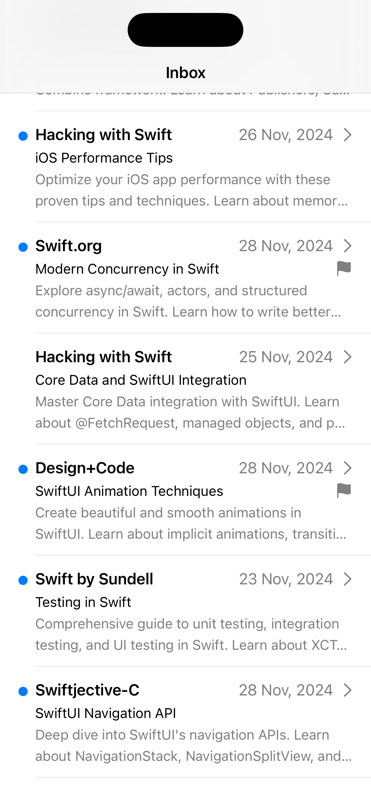
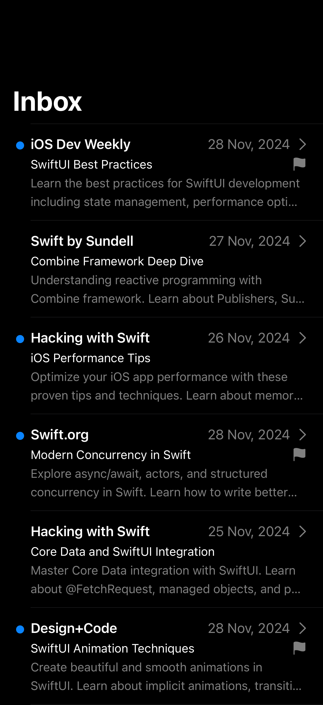

# Second Brain

An iOS app to collect and organize your reading list.

## Features

- Collect articles and web content
- Organize with flags and read status
- Track reading progress
- Clean, minimal interface

## Screenshots

  
  

## Development

Built with:
- SwiftUI
- Mockable framework for test data
- MVVM architecture

## Getting Started

1. Clone the repository
2. Open `second-brain.xcodeproj` in Xcode
3. Build and run the project

## Requirements

- iOS 17.0+
- Xcode 15.0+
- Swift 5.9+
